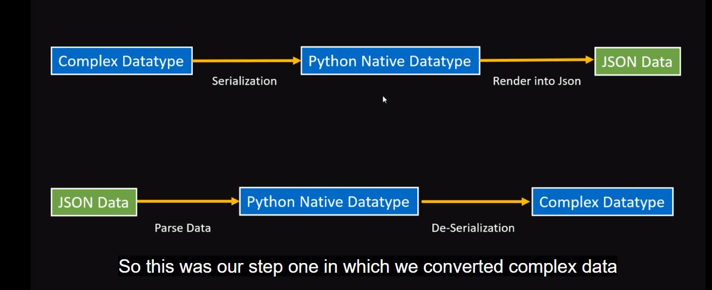
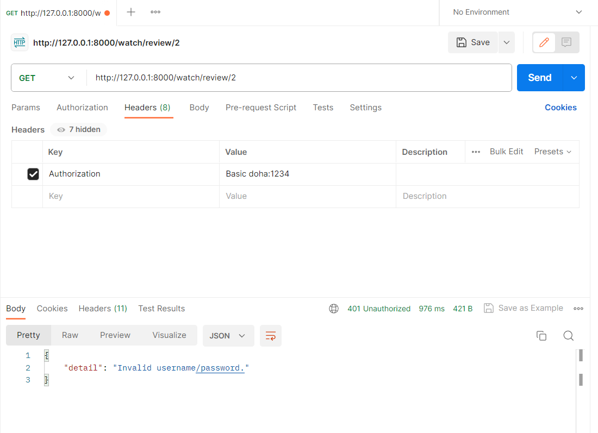

# DjangoCourse

## Serialization and deserialization process

# Basic Authentication using Postman:
**After adding the authentication in settings.py and adding a permission for any view we should be a logged in user to get review for example
and to be logged in user using postman is to send user info using Headers bar but the user info should be in base64 encoded format**

Before Encoding:

After Encoding:

## A website to convert to Base64: https://www.base64encode.org/