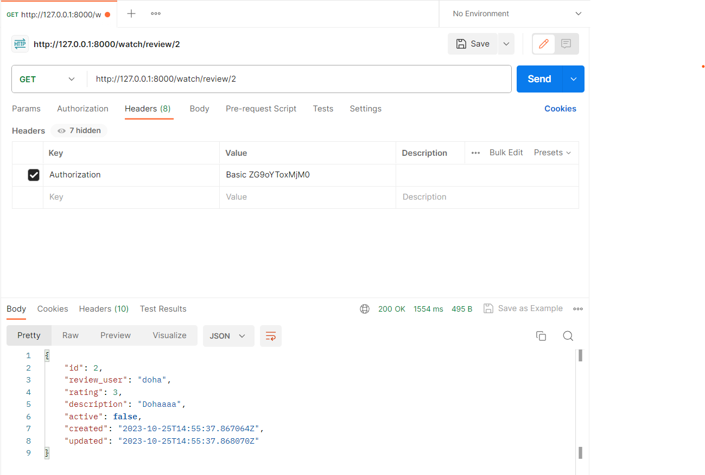

# DjangoCourse

## Serialization and deserialization process

# Basic Authentication using Postman:
**After adding the authentication in settings.py and adding a permission for any view we should be a logged in user to get review for example
and to be logged in user using postman is to send user info using Headers bar but the user info should be in base64 encoded format**

Before Encoding:

After Encoding:

## A website to convert to Base64: https://www.base64encode.org/

# Token Authentication using Admin panel: 

# Token Authentication using Postman: 
## Copy the token from the Admin panel:
### Here I send GET request to ReviewDetail View which is using ReviewUserOrReadOnly permission(only the review user can edit) and login with token of Sara user while the review user is doha(its okay because its GET request)

###  Here if the request is PUT(the review user(doha) can only edit) and the token is for Sara user

###  Here if the request is PUT(the review user(doha) can only edit) and the token is for doha user

## Create a URL take the username and password and get the token:

## Create a URL to add User

# JWT Authentication using Postman: 

## Create a URL take the username and password and get the pair token:

### Before Access Token expired:

### After Access Token expired:

## Create a URL take the Refresh  token to get a new Access token after expired:
